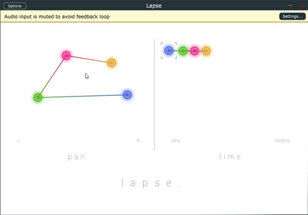

### Overview:

Lapse is a node-based delay plugin designed to visually represent delay in an interactive way. Lapse will allow you to create funky delays through automating delay time, feedback, and panning parameters through its intuitive user interface.

------------------

### How to use:

1. Add Lapse to a track in your chosen DAW.

2. Double click to create a delay node.

3. Click and drag on a node to change parameter values.

------------------

### To install on MacOSX:

1. Navigate to the "Files For Users" folder.

2. Select the folder with the correct plugin format for your DAW (vst2, vst3, AU)

3. Select the MacOSX folder 

4. Copy the plugin file (either Lapse.vst, Lapse.vst3, or Lapse.component) into the corresponding plugin directory. This could look like:

Library/Audio/Plug-Ins/VST
Library/Audio/Plug-Ins/VST3
Library/Audio/Plug-Ins/Component

5. Launch Lapse within chosen DAW :)

### To install on Windows:

1. Navigate to the "Files For Users" folder.

2. Select the folder with the correct plugin format for your DAW (vst2, vst3)

3. Select the Windows folder 

4. Copy the plugin file (either Lapse.dll or Lapse.vst3) into your plugin directory. This could look like:
	
C:/ProgramFiles/VSTPlugins
C:/ProgramFiles/Steinberg/VSTPlugins
C:/ProgramFiles(86)/VSTPlugins
C:/ProgramFiles(86)/Steinberg/VSTPlugins

5. Launch Lapse within chosen DAW :)
